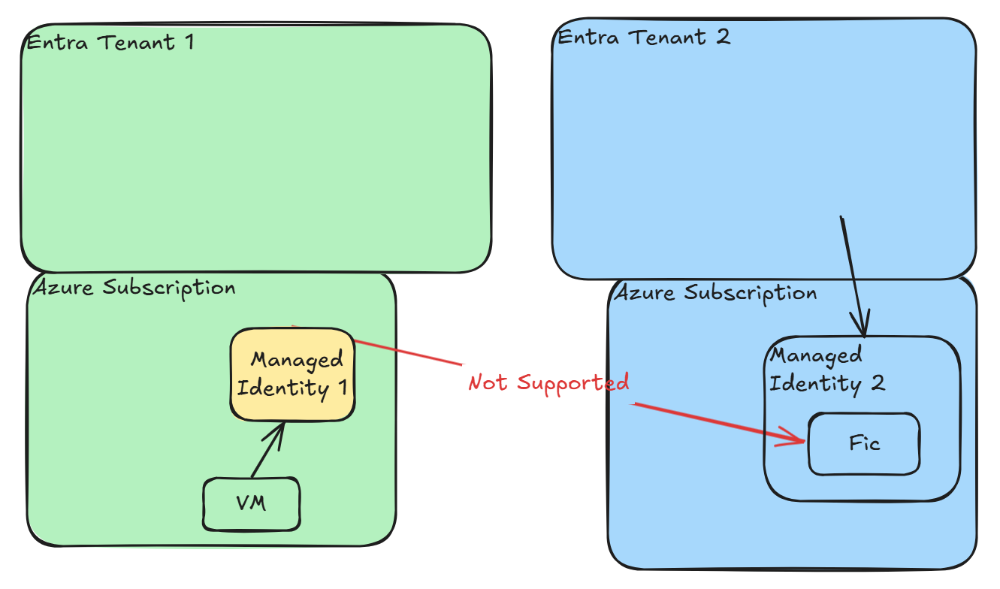

# Entra Cross-Tenant Application Federated Identity Credential (FIC)

Experimenting with Entra cross-tenant application Federated Identity Credential trust to Managed Identity

Public Preview announcement blog December 2024
<https://devblogs.microsoft.com/identity/access-cloud-resources-across-tenants-without-secrets>

Public Preview documentation
<https://learn.microsoft.com/en-us/entra/workload-id/workload-identity-federation-config-app-trust-managed-identity>

## Scenarios




## Create resources for testing

Create VM to use for testing

```bash
az group create --name rg-entra-fic --location eastus2
az vm create --resource-group rg-entra-fic --name vm-entra-fic --image Ubuntu2404 --admin-username azureuser --size Standard_D2ds_v5 --generate-ssh-keys
```

Create user assigned managed identity and assign it to the VM

```bash
az identity create --resource-group rg-entra-fic --name uami-entra-fic
uamiPrincipalId=$(az identity show --resource-group rg-entra-fic --name uami-entra-fic -o json --query principalId --output tsv)
echo $uamiPrincipalId
az vm identity assign --resource-group rg-entra-fic --name vm-entra-fic --identities uami-entra-fic
```

SSH into the VM and get managed identity access token for ARM and separately for credentials exchange

```bash
ssh azureuser@20.1.170.114 -i ~/.ssh/id_rsa
curl 'http://169.254.169.254/metadata/identity/oauth2/token?api-version=2023-11-15&resource=https://management.azure.com/' -H Metadata:true | jq
```

Create new multi-tenant Entra application registration and service principal

```bash
az ad app create --display-name app-entra-fic --sign-in-audience AzureADMultipleOrgs
az ad sp create --id 83d59817-87fd-4a0f-a6b9-09c04d126368
```

Create federated identity credential on the application

```bash
az ad app federated-credential create --id 83d59817-87fd-4a0f-a6b9-09c04d126368 --parameters fic.json
az ad app federated-credential list --id 83d59817-87fd-4a0f-a6b9-09c04d126368 -o json
```

SSH into the VM and get managed identity access token for credentials exchange

```bash
curl 'http://169.254.169.254/metadata/identity/oauth2/token?api-version=2023-11-15&resource=api://AzureADTokenExchange' -H Metadata:true | jq
```

Decoded in <https://jwt.ms>


## Review Failure Modes

* AADSTS700227: Forbidden token audience when setting to issuer like <https://sts.windows.net/>
* AADSTS7002121: No matching federated identity record found for presented assertion audience <https://management.azure.com/>
* AADSTS700211: No matching federated identity record found for presented assertion issuer <https://login.microsoftonline.com/13051989-33ba-4ced-b4a4-b56aac699948/v2.0>
* AADSTS700222: AAD-issued tokens may not be used for federated identity flows. (which is the same error as in the past)
* AADSTS700226: Only MSI tokens may be used as Federated Identity Credentials for AAD issuer. (when trying to use tokens from app registration to another app registration)
* AADSTS700236: Entra ID tokens issued by issuer <https://login.microsoftonline.com/13051989-33ba-4ced-b4a4-b56aac699948/v2.0> may not be used for federated identity credential flows for applications or managed identities registered in this tenant.

As of December 23, 2024, the documentation lists the limitation of having AAD-issued FIC on managed identities
<https://learn.microsoft.com/en-us/entra/workload-id/workload-identity-federation#supported-scenarios>


Example error message that we were getting previously (see [old video from February 2022](https://arsenvlad.medium.com/azure-active-directory-workload-identity-federation-with-external-oidc-idp-4f06c9205a26))

